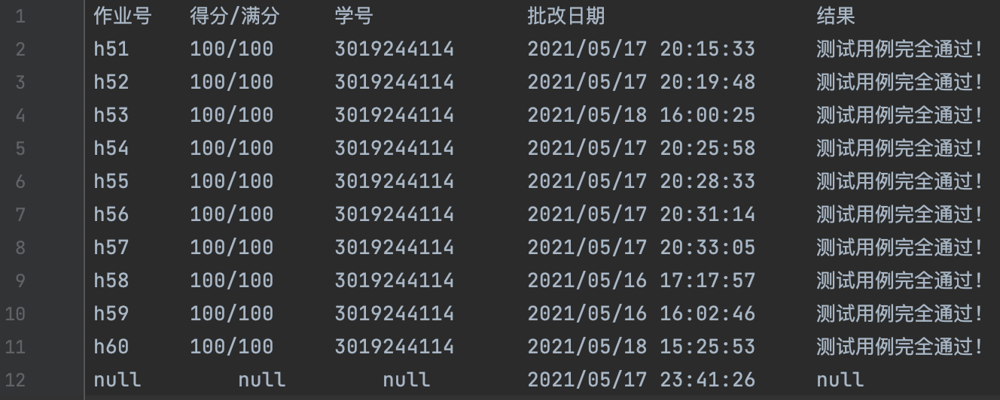
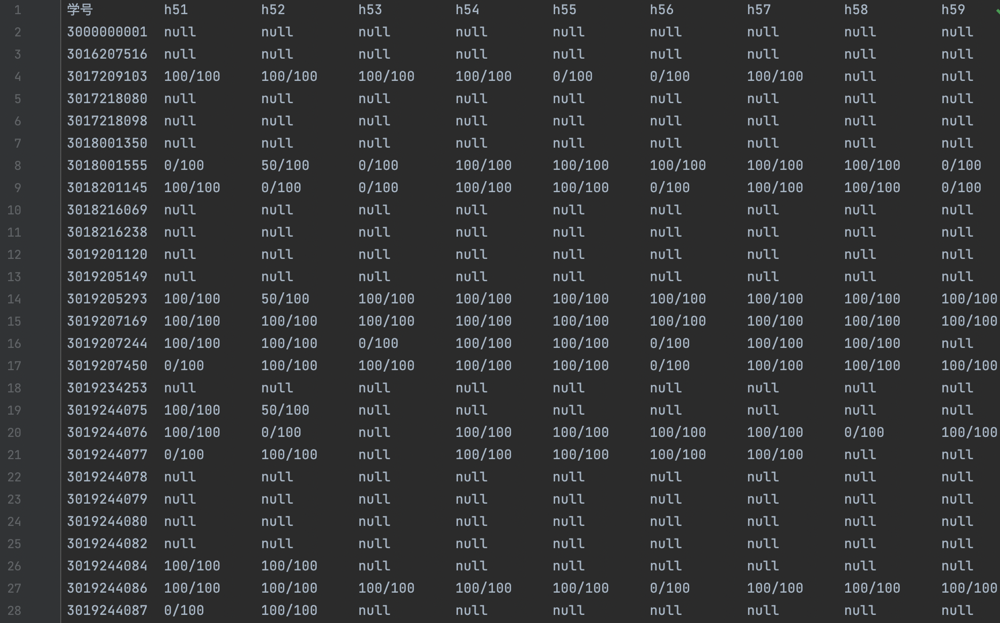

<br />

<p align="center">
  <h1 align="center">Show-Scores</h1>
  <p align="center">
    一个智能分析成绩结果的项目
    <br />
    <br />
    <br />
    <a href="https://github.com/SuperPung/Show-Scores">查看Demo</a>
    ·
    <a href="https://github.com/SuperPung/Show-Scores/issues">报告Bug</a>
    ·
    <a href="https://github.com/SuperPung/Show-Scores/issues">提出新特性</a>
  </p>


</p>

<!-- PROJECT SHIELDS -->

[![Contributors][contributors-shield]][contributors-url]
[![Forks][forks-shield]][forks-url]
[![Stargazers][stars-shield]][stars-url]
[![Issues][issues-shield]][issues-url]
[![MIT License][license-shield]][license-url]

<!-- PROJECT LOGO -->


还在因为《面向对象程序设计》的分数烦恼吗？快来使用 [Show-Scores](https://github.com/SuperPung/Show-Scores)，分析自己的成绩吧！

## 目录

- [特性](#特性)
- [开始](#开始)
     - [配置要求](#配置要求)
  - [安装步骤](#安装步骤)
  - [用法](#用法)
- [文件目录说明](#文件目录说明)
- [开发的架构](#开发的架构)
- [部署](#部署)
- [使用到的框架](#使用到的框架)
- [TODO](#TODO)
- [贡献者](#贡献者)
  - [如何参与开源项目](#如何参与开源项目)
- [版本控制](#版本控制)
- [作者](#作者)
- [版权说明](#版权说明)


### 特性

直观查看个人所有成绩：



还可以查看所有同学的成绩：




### 开始

#### 配置要求

需要 Java 8 环境。

#### 安装步骤

克隆本仓库

```sh
git clone https://github.com/SuperPung/Show-Scores.git
```

#### 用法

1. 将所有学生 `学号.txt` 文件拷贝至 `.raw/` 文件夹下。
2. 运行 `App.java`：
	- 命令行参数为空，默认打印所有学生成绩；
	- 命令行参数为一位同学的学号，则打印该学生的成绩。
3. 打印结果存放在 `.out/score.txt` 中。


### 文件目录说明

```
Show-Scores
├─ README.md					# 说明
├─ lib
├─ out
│  └─ score.txt				# 结果输出
├─ raw
│  └─ 3019244114.txt	# 学号文件，现支持多个
├─ Show-Scores.iml
└─ src
   ├─ App.java				# 主文件
   ├─ Homework.java		# 作业类
   ├─ AllScore.java		# 多成绩类
   └─ Score.java			# 单成绩类

```


### 开发的架构 

暂无


### 部署

暂无


### 使用到的框架

暂无


### TODO

- [x] 单学生成绩打印
- [x] 多学生成绩打印
- [ ] 单学生成绩多维度分析
- [ ] 多学生成绩多维度分析
- [ ] ？


### 贡献者

[me](https://github.com/SuperPung)

#### 如何参与开源项目

贡献使开源社区成为一个学习、激励和创造的绝佳场所。你所作的任何贡献都是**非常感谢**的，快来一起添加更多功能吧！


1. Fork the Project
2. Create your Feature Branch (`git checkout -b feature/AmazingFeature`)
3. Commit your Changes (`git commit -m 'Add some AmazingFeature'`)
4. Push to the Branch (`git push origin feature/AmazingFeature`)
5. Open a Pull Request


### 版本控制

该项目使用 Git 进行版本管理。您可以在 repository 参看当前可用版本。


### 作者

[SUPER](https://github.com/SuperPung)@[SuperPung](https://blog.superpung.xyz)


### 版权说明

该项目签署了 MIT 授权许可。


### 鸣谢


- [JetBrains](https://www.jetbrains.com)
- [GitHub Emoji Cheat Sheet](https://www.webpagefx.com/tools/emoji-cheat-sheet)
- [Img Shields](https://shields.io)
- [Choose an Open Source License](https://choosealicense.com)


<!-- links -->

[your-project-path]:SuperPung/Show-Scores
[contributors-shield]: https://img.shields.io/github/contributors/SuperPung/Show-Scores.svg?style=flat-square
[contributors-url]: https://github.com/SuperPung/Show-Scores/graphs/contributors
[forks-shield]: https://img.shields.io/github/forks/SuperPung/Show-Scores.svg?style=flat-square
[forks-url]: https://github.com/SuperPung/Show-Scores/network/members
[stars-shield]: https://img.shields.io/github/stars/SuperPung/Show-Scores.svg?style=flat-square
[stars-url]: https://github.com/SuperPung/Show-Scores/stargazers
[issues-shield]: https://img.shields.io/github/issues/SuperPung/Show-Scores.svg?style=flat-square
[issues-url]: https://img.shields.io/github/issues/SuperPung/Show-Scores.svg
[license-shield]: https://img.shields.io/github/license/SuperPung/Show-Scores?style=flat-square
[license-url]: https://github.com/SuperPung/Show-Scores/blob/master/LICENSE
